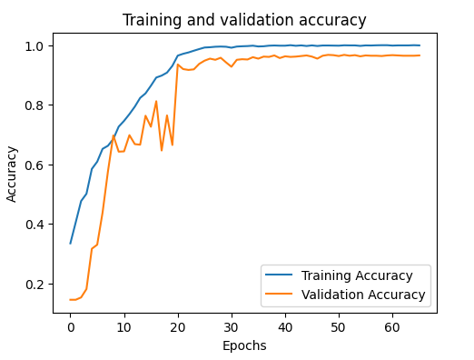
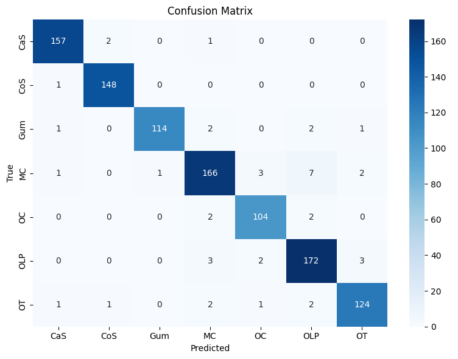

# 🦷 Teeth Classification using Deep Learning

This project implements a deep learning pipeline to classify dental images into **7 categories** using a Convolutional Neural Network (CNN). It includes all the essential steps from dataset preparation and augmentation to training, evaluation, and a web demo using Streamlit.

---

## 📊 Project Overview

The goal of this project is to develop a robust AI model capable of classifying teeth into 7 distinct categories to support AI-driven dental diagnostics. Accurate classification enhances diagnostic precision and improves patient outcomes in the dental healthcare industry.

---

## 📚 Dataset

The model was trained on the **Teeth Dataset**, which is organized into three subsets:

- **Training Set**: 3087 images  
- **Validation Set**: 1028 images  
- **Testing Set**: 1028 images

Each subset contains images from the following 7 classes:
- Gum
- MC
- OT
- CoS
- OC
- OLP
- CaS

> ⚠️ Ensure the Testing folder contains only valid class subfolders before running the notebook.

### 📥 How to Get the Data

You can download the dataset directly from [Google Drive](https://drive.google.com/file/d/1WEySXMFz6v1OgPkLKJ8QIp3Lk-eyTObY/view?usp=sharing).

Once downloaded, extract the dataset and ensure it has the following structure:
```
Teeth_Dataset/
├── Training/
├── Validation/
└── Testing/
```

---

## 📌 Project Features

- ✅ Preprocessing with normalization and augmentation
- ✅ Class distribution visualization
- ✅ Manual image resizing with OpenCV
- ✅ Augmentation preview
- ✅ CNN model built using TensorFlow/Keras
- ✅ Accuracy and loss plots
- ✅ Fully annotated and professional Jupyter Notebook
- ✅ **Streamlit App for Live Predictions**

---

## 🛠️ Steps Covered

1. **Data Cleaning & Organization**
2. **Class-wise Image Count & Distribution**
3. **Preprocessing & Augmentation**
4. **Optional Manual Image Resizing**
5. **Data Loading with ImageDataGenerator**
6. **CNN Model Building**
7. **Model Training**
8. **Performance Evaluation**
9. **Live Demo via Streamlit App**

---

## 📲 Streamlit Web App

We include a `Streamlit` app to enable **live predictions** using uploaded dental images.

### 🔄 How It Works

- Upload a dental image via the interface
- The model predicts one of the 7 classes
- Displayed with confidence score and predicted label

### ▶️ Run the App

Make sure your model file (e.g. `teeth_classification_model_with_FineTune.keras`) is in the same directory as your app script.

```bash
streamlit run app.py
```

You can also deploy this app using Streamlit Cloud or Hugging Face Spaces.

## 🎥 Demo Video

Watch the demo:


## 📊 Visualizations
### 🔸 Training & Validation Plots


Training vs. Validation Accuracy



Training vs. Validation Loss


### 🔸 Confusion Matrix



## 🚀 Model Architecture

A simple CNN with:

1. 2 Convolutional layers + MaxPooling

2. Flatten + Dense

3. Dropout regularization

4. Softmax output layer for 7-class classification

## 🧪 Dependencies

- Python 3.x

- TensorFlow 2.x

- OpenCV

- Matplotlib

- Streamlit

## Install requirements:
```
pip install tensorflow opencv-python matplotlib streamlit
```

## 📎 Usage

Open the Jupyter notebook:
```
Teeth_Classification_Enhanced.ipynb
```

Or launch the app:
```
streamlit run app.py
```
## 📬 Contact

For questions or collaboration, feel free to reach out.
